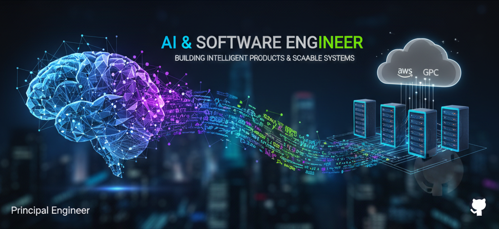

  

<h1 align="center">
  👋 Hi, I'm a Principal AI & Software Engineer
</h1>

  <strong>Building scalable systems, intelligent products, and high-impact engineering teams</strong>

---

## 🧠 About Me

I’m a **Principal AI & Software Engineer** with **7+ years of experience** designing, building, and scaling **production-grade software systems** across startups and enterprise environments.

My expertise spans **Full-Stack Engineering, Backend Systems, AI/ML, and DevOps**, with a strong focus on **performance, scalability, and clean architecture**. I specialize in turning complex requirements into reliable, elegant solutions that scale.

I’ve led and delivered systems involving:
- Large-scale **data pipelines & analytics platforms**
- **AI-powered applications** using LLMs and real-time inference
- **High-performance backend services** and APIs
- **Modern frontend architectures** with excellent UX
- **Cloud-native & DevOps-driven deployments**

---

## 🚀 Core Expertise

### 🧩 Software Engineering
- **Languages:** Python, C, C++, C#, Go, JavaScript, TypeScript  
- **Backend:** FastAPI, Node.js, NestJS, Django, .NET, gRPC, REST, GraphQL  
- **Frontend:** React, Next.js, Angular, Vue  
- **Databases:** PostgreSQL, MongoDB, MySQL, Redis  

### 🤖 AI / ML / Computer Vision
- **LLMs & AI:** OpenAI, LangChain, RAG, prompt engineering  
- **ML & Data:** Pandas, NumPy, Scikit-learn, model pipelines  
- **Computer Vision:** OpenCV, image/video processing  
- **AI Systems:** Real-time AI, Voice AI, intelligent automation  

### 📊 Data Analytics & Visualization
- Data processing & transformation pipelines  
- Excel / CSV import-export at scale  
- Analytics dashboards & visual storytelling  
- D3.js, Chart.js, data-driven UI  

### ☁️ DevOps & Cloud
- **Cloud:** AWS, GCP  
- **Containers & Orchestration:** Docker, Kubernetes  
- **CI/CD:** GitHub Actions, GitLab CI, Jenkins  
- **Infra:** Nginx, Linux, monitoring & automation  

---

## 🧪 Testing & Quality
- Jest, Vitest, Testing Library  
- Playwright, Cypress  
- Storybook, end-to-end testing  
- Strong focus on **maintainability & reliability**

---

## 💼 What I’ve Delivered

- End-to-end **AI-enabled platforms** used in production  
- **Scalable backend systems** handling complex business logic  
- **High-performance data workflows** (analytics, reporting, Excel I/O)  
- **Cloud-native infrastructure** supporting rapid growth  
- **Cross-functional leadership**, from architecture to delivery  

---

## 🛠️ How I Work

- ✨ Clean, readable, and maintainable code  
- 📐 Strong system design & architectural thinking  
- 🚀 Fast iteration with production-grade quality  
- 🤝 Clear communication & team leadership  
- 📚 Continuous learning & open-source mindset  

---

## 🌱 Currently
- Building AI-powered systems & scalable platforms  
- Exploring advanced LLM workflows & real-time AI  
- Open to **high-impact collaborations & leadership roles**

---

##

  
   
  
  
  
  
  
  
  
  
  
  
  
  
  
  
  
  
  
  
  
  
  
  
  

### 

#### Skills & Technologies

**[mlcourse.ai](https://mlcourse.ai) – Open Machine Learning Course**

## 🔧 My Skill Set  
<table><tr><td valign="top" width="33%">

### Frontend  

  
  
  
  
  
  
  
  
  
  
  
  
  
  
  
  
  
  
  
  
  
  
  
  
  
  
  
  
  
  
  
  
  
  
  
  
  
  
  

</td><td valign="top" width="33%">

### Backend  

  
  
  
  
  
  
  
  
  
  
  
  
  
  
  
  
  
  
  
  
  
  
  
  
  
  
  
  
  
  
  
  
  

</td><td valign="top" width="33%">

### DevOps  

  
  
  
  
  
  
  
  
  
  
  
  
  
  

</td></tr></table>  

##

## 🌟 Let’s Collaborate

If you're building something ambitious—**AI products, scalable platforms, or complex systems**—I’d love to collaborate.

> *Engineering with purpose. Shipping with excellence.*
